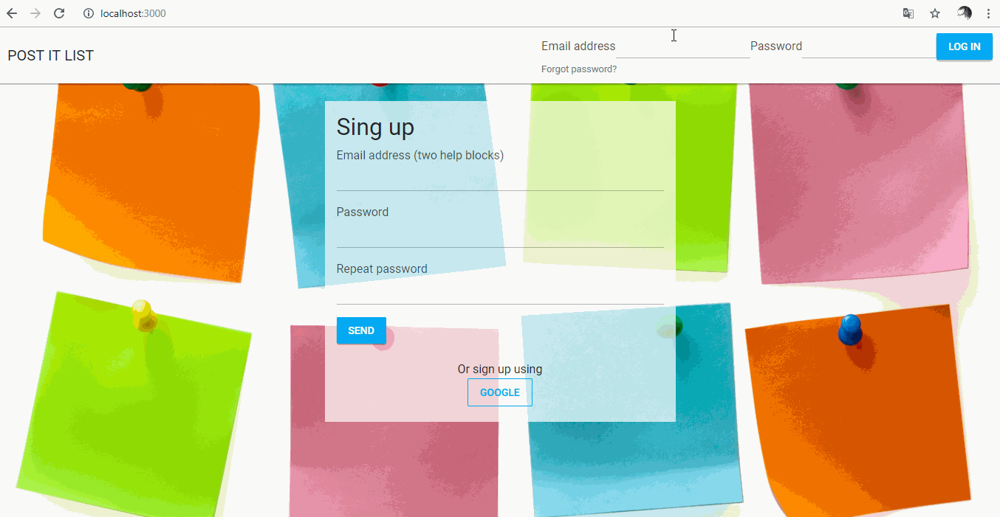

# POST IT LIST with React JS

## DEMO

## Resumen

Aplicativo web basado en la metodologia "KANBAN" para la organización de tareas.

## Modo de uso

### - 1er paso

Regístrate o ingresa con tu cuenta de Google para una mejor experiencia.

### - 2do paso

Una vez registrado, accede con el correo electrónico y contraseña de tu registro.

### - 3er paso

Ya adentro de la aplicación puedes crear una lista para empezar a trabajar. Quizás podrías ponerle el nombre del proyecto que estas llevando a cabo en estos momentos.

### - 4to paso

Luego de crear la lista, dale click en '_see task_' para que puedas empezar a crear tus tareas.

### - 5to paso

Crea tu primera tarea. Puedes editarla y eliminarla si es que así lo deseas.

### - 6to paso

En la parte superior de tu tarea encontrarás los botones '_to do_', '_doing_' y '_done_'. Con estos puedes modificar el avance de tus tareas, es decir, si estas realizando la tarea le das click en '_doing_' y esta tarea se moverá automáticamente a esa sección.

### - 7mo paso

Listo. Puedes repetir estos pasos cuanto desees.

## Objetivo

Programar un to-do list que permita crear tareas, darlas por completadas y 
eliminarlas.

**Demo:**

## Consideraciones generales

Este proyecto se debe "resolver" de forma individual.

Se deberá desarrollar con una de estas tres herramientas: Angular, 
React o Vue; previamente elegida por ti.

Se puede replicar el diseño propuesto o crear su propio estilo.

Para comenzar tendrás que hacer un _fork_ y _clonar_ este repositorio.

## Recursos

### React

* [React - docs oficiales](https://reactjs.org/)
* [React - tutorial](https://egghead.io/courses/the-beginner-s-guide-to-react)
* [create-react-app](https://github.com/facebook/create-react-app)
* [React js en español - tutorial básico, primeros pasos y ejemplos - frontendlabs.io](https://frontendlabs.io/3158--react-js-espanol-tutorial-basico-primeros-pasos-ejemplos)

### Angular

* [Angular - docs oficiales](https://angular.io/)
* [Angular CLI](https://cli.angular.io/)
* [Angular - tutorial](https://www.youtube.com/watch?v=0eWrpsCLMJQ&list=PLC3y8-rFHvwhBRAgFinJR8KHIrCdTkZcZ)
* [Angular - crud](https://www.youtube.com/watch?v=6wVolJfXn1c)

### Vue

* [Vue - docs oficiales](https://vuejs.org/)
* [Vue CLI](https://cli.vuejs.org/)
* [Vue- adicional](https://scotch.io/search?q=vue)
* [Vue- school](https://vueschool.io/)

## Checklist

### Parte obligatoria

#### General

* [ ] El `README.md` debe contener un resumen de lo que encontraremos en tu 
proyecto.

#### Funcionalidades

* [x] Permite crear nuevas tareas.
* [x] No debe dejar agregar tareas vacías de ningún tipo.
* [x] Permite marcar las tareas completadas.
* [x] Permite eliminar tareas específicas.
* [x] Deberá contener mínimo 2 componentes.

#### Desplegado

* [x] Deberá ser desplegado en gh-pages, Heroku, etc.

### Hacker Edition

* [x] Editar la tarea.
* [ ] Implementar las operaciones de CRUD de la data con Firebase.

